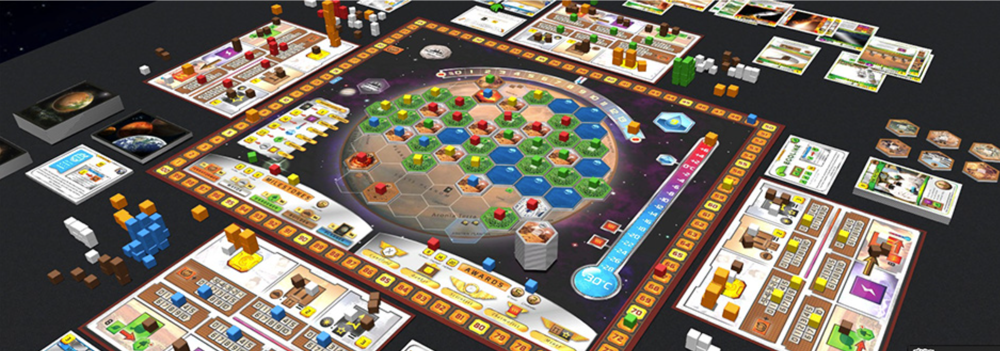
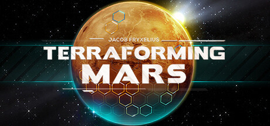

# My Favorite Board Game

## Terraforming Mars

Terraforming Mars is a board game played between 1-5 players. The game takes anywhere between 2-8+ hours, depending on whether Steven Kwan is playing. In this board game the players take on the roles of different coorporations to terraform mars. To terraform a player must take one or several of these actions: raise the temperature and oxygen, build cities, make oceans and greeneries. Once all the terraforming requirements are met, whomever gained the most points by terraforming the most wins.

## What I Like About Terraforming Mars 
- Makes you think critically
  Complex systems with many hard decisions.
- Can use different strategies for every game
  Various ways to win and succeed, can focus on trade or production for example.
- Every game is different even if you play with the same coorporation
  Immmense replayability.

## Terraforming Mars game
In 2018, Twin Sails interactive published a top-down computer game adaptation of the tabletop game of the same name.

